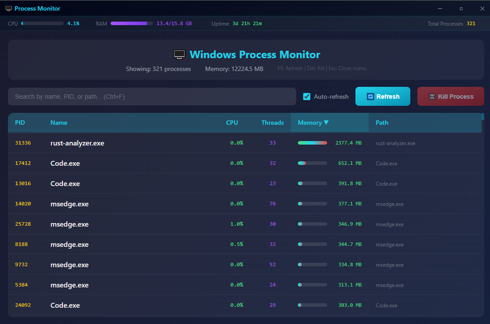

# 🖥️ DioProcess - Windows System Monitor

A modern, lightweight Windows system monitor built with **Rust**, **Dioxus**, and **Windows API**.




## ✨ Features

### 📑 Tab Navigation
- **Processes Tab** - Monitor and manage running processes
- **Network Tab** - View active network connections (TCP/UDP)

### Process Management
- 📋 **Process List** - View all running processes with PID, name, CPU, threads, memory, and path
- 🔍 **Search & Filter** - Quick search by process name, PID, or executable path
- ⚡ **Real-time Updates** - Auto-refresh every 3 seconds (toggleable)
- ☠️ **Kill Process** - Terminate processes with a click or keyboard shortcut
- 📊 **Sortable Columns** - Sort by PID, Name, CPU, Threads, or Memory (ascending/descending)

### Network Monitoring
- 🌐 **Connection List** - View all TCP and UDP connections
- 🔌 **Port Information** - Local and remote addresses with ports
- 📡 **Connection State** - LISTEN, ESTABLISHED, TIME_WAIT, CLOSE_WAIT, etc.
- 🔗 **Process Mapping** - See which process owns each connection
- 🔍 **Filters** - Filter by protocol (TCP/UDP) and connection state
- ☠️ **Kill Process** - Terminate the process using a port
- 📂 **Open File Location** - Navigate to the executable

### System Monitoring
- 🖥️ **CPU Usage** - Global CPU usage with visual progress bar
- 💾 **RAM Usage** - Memory consumption (used/total GB) with progress bar
- ⏱️ **System Uptime** - Time since last boot
- 📈 **Process Count** - Total number of running processes

### User Interface
- 🎨 **Modern Dark Theme** - Sleek gradient design
- 🪟 **Borderless Window** - Custom title bar with drag, minimize, maximize, close
- 📱 **Responsive Layout** - Adapts to window resizing
- 🔀 **Tab-based Navigation** - Switch between Processes and Network views

### Context Menu (Right-Click)
- ☠️ Kill Process
- ⏸️ Suspend Process
- ▶️ Resume Process
- 📂 Open File Location
- 📋 Copy PID
- 📝 Copy Path
- 🧵 View Threads
- 🔗 View Handles
- 📦 View Modules
- 💉 DLL Injection (submenu)
  - 💉 LoadLibrary - Classic CreateRemoteThread + LoadLibraryW
  - 🧵 Thread Hijack - Suspend thread, redirect RIP to shellcode
  - 🗺️ Manual Map - Map PE sections, resolve imports, call DllMain
- 🔄 Refresh List

### Thread View (Right-click → View Threads)
- 🧵 View all threads of a process in a modal window
- ⏸️ Suspend individual threads
- ▶️ Resume individual threads
- ☠️ Kill threads (use with caution!)
- 📋 Copy Thread ID
- Auto-refresh thread list

### Handle View (Right-click → View Handles)
- 🔗 View all handles (files, registry, events, etc.) of a process
- 🔍 Filter handles by type
- ✕ Close handles (use with caution!)
- 📋 Copy Handle value
- Color-coded handle types (File, Registry, Process, Sync, Memory, etc.)

### Module View (Right-click → View Modules)
- 📦 View all loaded DLLs/modules of a process
- 🔍 Filter modules by name or path
- 📊 View module base address, size, and entry point
- 🔬 Inspect module imports (functions imported from other DLLs)
- 💉 Inject DLL into process (LoadLibrary method)
- ⏏️ Unload/eject modules from process
- 📋 Copy module path
- 📂 Open module file location
- Auto-refresh module list

### Keyboard Shortcuts
| Key | Action |
|-----|--------|
| `F5` | Refresh list |
| `Delete` | Kill selected process |
| `Escape` | Close context menu |

## 🚀 Getting Started

### Prerequisites
- [Rust](https://rustup.rs/) (2021 edition)
- Windows 10/11

### Build & Run

```bash
# Clone the repository
git clone https://github.com/un4ckn0wl3z/dioprocess.git
cd dioprocess

# Build release version
cargo build --release

# Run the application
.\target\release\dioprocess.exe
```

### Development

```bash
# Run in development mode
cargo run

# Build with optimizations
cargo build --release
```

## 📦 Dependencies

| Crate | Version | Purpose |
|-------|---------|---------|
| `dioxus` | 0.6 | Desktop UI framework with router |
| `tokio` | 1.x | Async runtime for auto-refresh |
| `sysinfo` | 0.31 | CPU/Memory system statistics |
| `windows` | 0.58 | Windows API bindings |
| `arboard` | 3.x | Clipboard operations |
| `ntapi` | 0.4 | Native Windows API for process suspension |

### Windows API Features Used

**process crate:**
- `Win32_System_Diagnostics_ToolHelp` - Process/Thread/Module enumeration
- `Win32_System_Threading` - Process/Thread management
- `Win32_System_ProcessStatus` - Memory information
- `Win32_Foundation` - Core Windows types
- `Win32_Security` - Process access rights
- `Win32_UI_Shell` - Shell operations

**network crate:**
- `Win32_NetworkManagement_IpHelper` - Network connections (TCP/UDP tables)
- `Win32_Networking_WinSock` - Socket address handling
- `Win32_Foundation` - Core Windows types

**misc crate:**
- `Win32_System_Memory` - Virtual memory allocation (for DLL injection)
- `Win32_System_LibraryLoader` - Module loading/unloading
- `Win32_System_Diagnostics_Debug` - Process memory operations, thread context manipulation
- `Win32_System_Kernel` - Thread context structures (CONTEXT)

## 📁 Project Structure

This project uses a **Cargo workspace** with five crates:

```
dioprocess/
├── Cargo.toml              # Workspace configuration
├── README.md
├── LICENSE
├── assets/
│   └── dll/                # Sample DLLs for injection testing
└── crates/
    ├── process/            # Library - Windows process APIs
    │   ├── Cargo.toml
    │   └── src/
    │       └── lib.rs      # Process, thread, handle, module APIs
    ├── network/            # Library - Windows network APIs
    │   ├── Cargo.toml
    │   └── src/
    │       └── lib.rs      # TCP/UDP network connection enumeration
    ├── misc/               # Library - Advanced process utilities
    │   ├── Cargo.toml
    │   └── src/
    │       └── lib.rs      # DLL injection (LoadLibrary, Thread Hijack, Manual Map) & unloading
    ├── ui/                 # Library - Dioxus UI components
    │   ├── Cargo.toml
    │   └── src/
    │       ├── lib.rs
    │       ├── routes.rs           # Tab routing (Process/Network)
    │       ├── state.rs            # Shared state types
    │       ├── helpers.rs          # Utility functions
    │       ├── styles.rs           # CSS styles
    │       └── components/
    │           ├── mod.rs
    │           ├── app.rs          # Main app with routing
    │           ├── process_tab.rs  # Process list view
    │           ├── network_tab.rs  # Network connections view
    │           ├── process_row.rs  # Process table row
    │           ├── thread_window.rs  # Thread modal
    │           ├── handle_window.rs  # Handle modal
    │           └── module_window.rs  # Module modal with DLL injection
    └── dioprocess/         # Binary - Desktop application entry
        ├── Cargo.toml
        ├── build.rs        # Windows manifest embedding
        ├── app.manifest    # UAC elevation manifest
        ├── resources.rc    # Windows resources
        └── src/
            └── main.rs     # Entry point, window configuration
```

### Crates

| Crate | Type | Description |
|-------|------|-------------|
| `process` | Library | Windows API bindings for process, thread, handle, and module management |
| `network` | Library | Windows API bindings for TCP/UDP network connection enumeration |
| `misc` | Library | Advanced utilities including DLL injection (LoadLibrary, Thread Hijack, Manual Map) and module unloading |
| `ui` | Library | Dioxus UI components with routing, styles, and state management |
| `dioprocess` | Binary | Desktop application entry point with Windows manifest |

## 📄 License

This project is open source and available under the [MIT License](LICENSE).

## 🤝 Contributing

Contributions are welcome! Feel free to:
- Report bugs
- Suggest features
- Submit pull requests


Built with ❤️ using Rust and Dioxus
