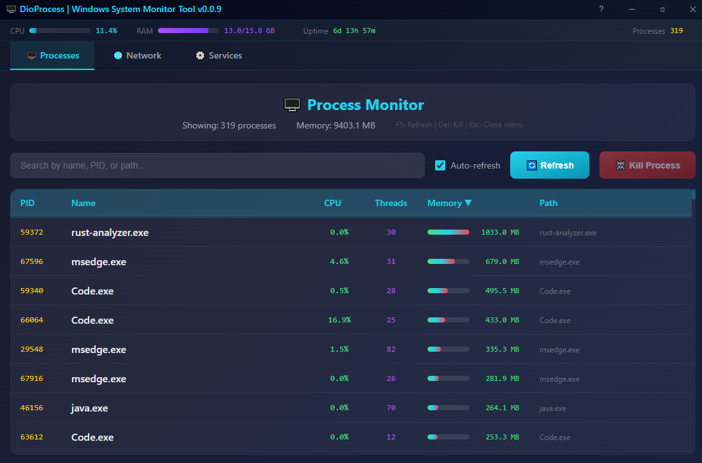

# DioProcess — Advanced Windows Process & System Monitor

> **⚠️ This public repository is archived and no longer maintained.**
>
> **→ For the full-featured version with ongoing development and rich features, see: [`dioprocess-private`](https://github.com/un4ckn0wl3z/dioprocess-private)**
>
> Development continues only in the private repository. This public version represents the final public release and will not receive further updates, features, or bug fixes.

---

Modern Windows desktop application for real-time system monitoring and low-level process manipulation.

Built with **Rust 2021** + **Dioxus 0.6** | **Requires administrator privileges**



[](https://www.rust-lang.org)
[](https://microsoft.com/windows)
[](https://dioxuslabs.com)

## Core Features

### Process Management
- Live enumeration of processes, threads, handles, modules & memory regions
- Process tree view with parent-child relationships
- Real-time CPU/memory performance graphs
- Process string scanning (ASCII & UTF-16)

### Network & Services
- TCP/UDP connection listing with owning process
- Windows Service management (enumerate, start, stop, create, delete)

### DLL Injection (7 methods)
- LoadLibrary, Thread Hijack, APC Queue, EarlyBird
- Remote Mapping, Function Stomping, Manual Mapping

### Shellcode Injection
- Classic (from file), Web Staging (from URL), Threadless

### Process Creation & Evasion
- PPID Spoofing
- Process Hollowing
- Process Ghosting
- Ghostly Hollowing
- Process Herpaderping
- Herpaderping Hollowing

### Security Research (Kernel Driver)
- Process Protection (PPL) manipulation
- Token Privilege Escalation
- Clear Debug Flags (anti-anti-debugging)
- Kernel Callback Enumeration
- PspCidTable Enumeration
- Kernel Injection (shellcode & DLL)

### DLL Analysis
- Hook Detection (IAT scanning)
- DLL Unhooking (restore from disk)

### System Events (Experimental)
- Real-time kernel event capture (process, thread, image, handle, registry)
- SQLite persistence with 24-hour retention

### Utilities
- File Bloating
- Token Theft

## Build & Run

```bash
cargo build --release
.\target\release\dioprocess.exe   # Run as administrator
```

## Keyboard Shortcuts

| Key | Action |
|-----|--------|
| `F5` | Refresh |
| `Delete` | Kill process |
| `Escape` | Close modal |

## Development Status

This public repository is **archived**:
- ✅ Fully functional for the features listed above
- ❌ No further updates or bug fixes planned
- ❌ Issues and pull requests not accepted

For new features and ongoing development, refer to the private repository at [`dioprocess-private`](https://github.com/un4ckn0wl3z/dioprocess-private).

## MIT licensed.

Built with Rust & Dioxus — 2025
